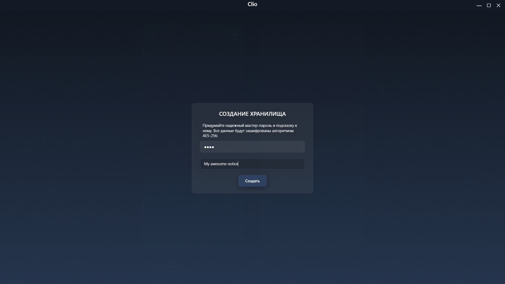
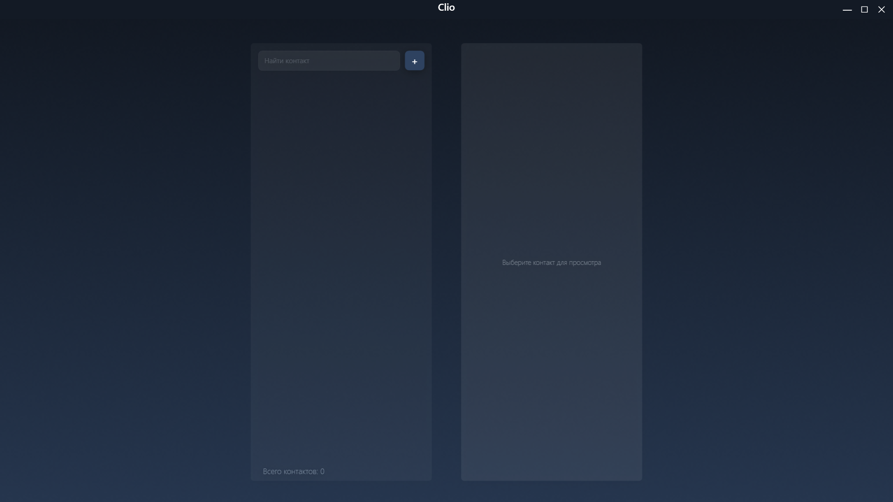
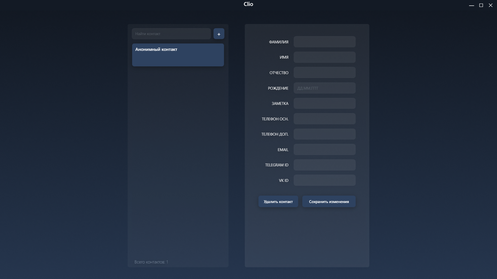
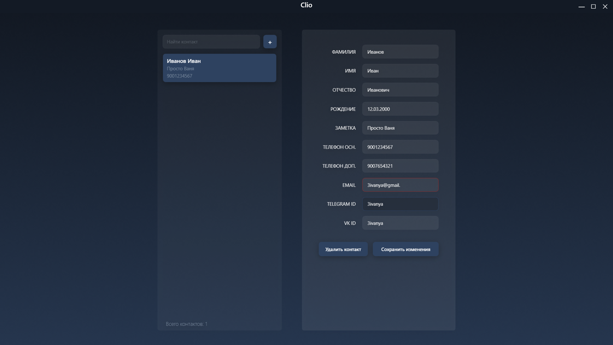
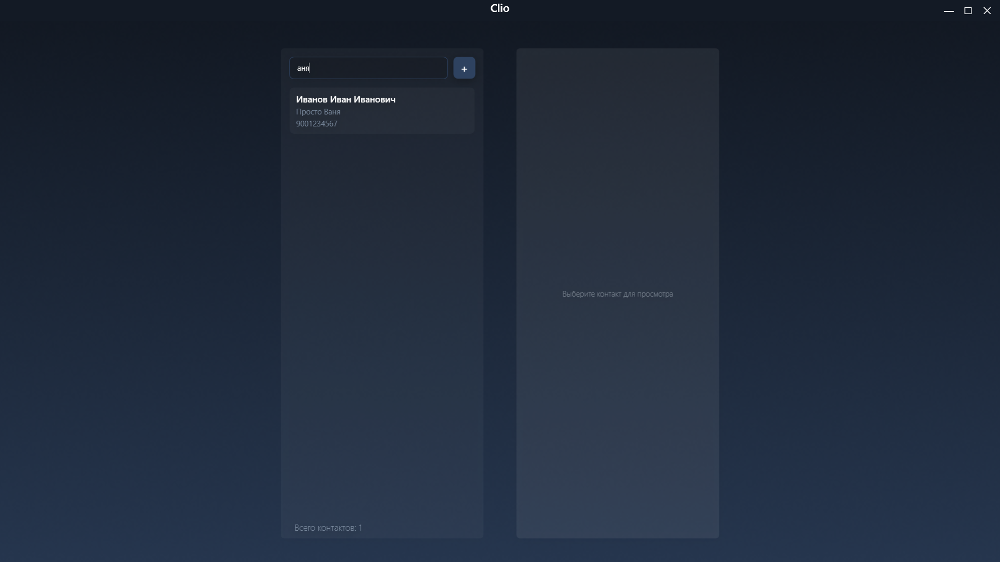
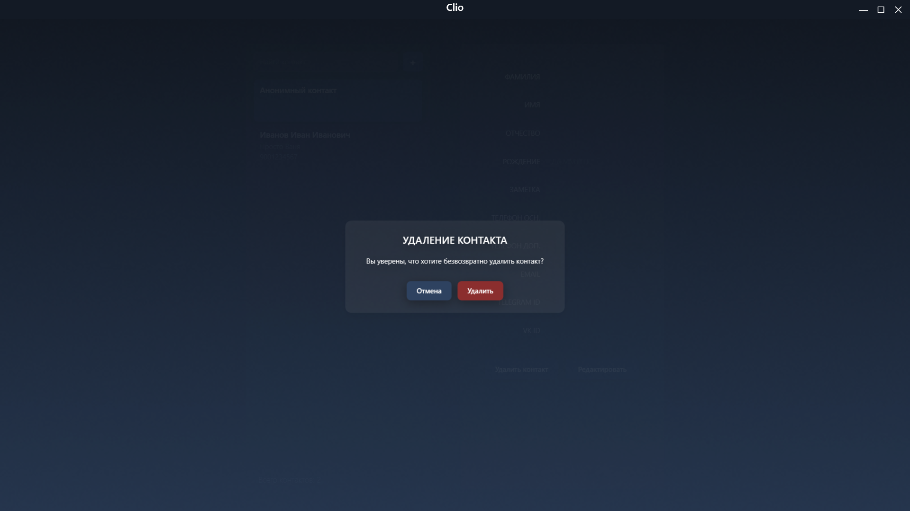
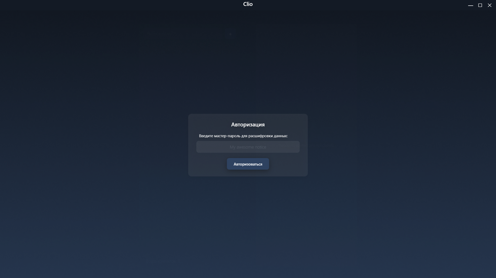

## Clio - защищенное оффлайн хранилище персональных данных

#### Общая информация

Данное программное обеспечение разработано с целью хранения персональных данных исключительно для личного использования, что не противоречит Федеральному закону №152 "О персональных данных". В качестве таковых, в приложении выступают ФИО, дата рождения, номера телефонов, адрес электронной почты и никнеймы в социальных сетях.

С целью защиты от утечек, программа полностью исключает интернет- и любые другие соединения со сторонним ПО, а также полностью шифрует все данные (за исключением подсказки) пользовательским мастер-паролем. Утеря мастер-пароля приводит к полной утрате доступа к сохраненным данным. 

Сами данные хранятся в портативной БД, представленной бинарным файлом с именем *db.clio*. В текущей версии, приложение поддерживает чтение только одного файла базы данных с указанным именем и расширением, расположенного в каталоге с исполняемым файлом приложения. 

#### Безопасность данных

Созданный приложением файл базы данных можно сохранять в облако, хранить его копию как бэкап на другом устройстве, либо внешнем цифровом носителе информации. Файл полностью автономен, для чтения достаточно поместить его в каталог с исполняемым файлом приложения той версии, в которой он был создан, и ввести валидный мастер-пароль.

Все содержимое файла защищено шифрованием по алгоритму AES-256 с применением добавляемого хэша (т.н. "соли"). Подсказка для пароля, для обеспечения ее доступности в окне авторизации, зашифрована посредством алгоритма Base64. 

Настоятельно не рекомендуется хранить базу данных в общем доступе, либо облачных хранилищах, если мастер-пароль не является достаточно криптостойким (например, состоящим только из числовых символов). Методом перебора, злоумышленник, получивший непосредственный доступ к файлу, взломает такой пароль меньше, чем за минуту. 

Следует использовать сложные мастер-пароли, содержащие цифры, латинские буквы различных регистров, а также символы. В качестве длины пароля, следует выбирать значение, превышающее 10 символов. 

В качестве подсказки для пароля, не рекомендуется указывать общеизвестные сведения, вроде даты рождения (своей или родственников), адреса, номеров телефонов и прочей информации, которая потенциально может быть доступна злоумышленнику на момент взлома.

 #### Алгоритм работы

При первом запуске приложения, пользователю предлагается придумать и ввести в конкретные поля мастер-пароль для новой базы данных, и текстовую подсказку к нему. Длина пароля и подсказки не имеет ограничений по длине, за исключением ограничений, продиктованных операционной системой. Без ввода пароля, дальнейшая работа в программе невозможна. Отказ от ввода подсказки резко снижает шансы на восстановление доступа к данным, в случае, если пароль был забыт или утерян.

После ввода пароля и подсказки, пользователю открывается главное окно приложение, состоящее из: 

- Левой колонки, содержащей список контактов, их счетчик, поисковую строку и кнопку добавления нового контакта;
- Правой колонки, содержащей набор полей, заполняемых информацией о контакте автоматически, как только он будет создан, либо выбран в списке; а также кнопки редактирования/сохранения данных и удаления контакта из списка. 

Для добавления нового контакта, достаточно кликнуть по кнопке *"+"* в левой колонке, расположенной справа от поисковой строки. Приложение при этом автоматически создаст в списке новый элемент с подписью *"Анонимный контакт"*, и откроет пользователю информацию о нем в режиме редактирования. Пустой контакт можно сохранить и редактировать позже, их многократное создание в текущей версии не ограничено.

При редактировании информации о контакте, следует учитывать следующие моменты: 

- Обязательные для заполнения поля отсутствуют в принципе - можно вообще ничего не писать и нажать *"Сохранить"*;
- Поле ввода даты рождения автоматически форматирует пользовательский ввод, руками расставлять точки или другие разделители не требуется; 
- Поле ввода номера телефона требует ввода 10 цифр без кода страны - для стационарных телефонов (код города + номер) это также работает;
- Поле ввода адреса почты проверяет вводимую строку на соответствие формату и подсвечивается красной рамкой, в случае ошибки; 
- В поля ввода никнеймов соцсетей, данные можно добавлять на усмотрение пользователя - как полноценную гиперссылку, так и только никнейм. 

В случае попытки сохранить контакт с некорректно введенными данными, информация не сохранится в базу данных. Это сделано во избежание порчи информации. Для сохранения, достаточно кликнуть по кнопке *"Сохранить изменения"*. 

Все контакты, как с заполненными полями, так и анонимные, отображаются в левой колонке, отсортированные по имени в алфавитном порядке. В силу того, что в текущей версии приложения отсутствует группировка контактов, а их количество не ограничено - внизу левой колонки присутствует счетчик, дающий пользователю представление об объеме списка. 

В верхней части колонки представлена поисковая строка, осуществляющая полностью сквозной поиск в процессе ввода: это означает, что вхождение  введенной строки ищется во всем - начиная от имени, заканчивая никнеймом в какой либо соцсети. Контакты, соответствующие запросу, продолжают отображаться в списке, остальные скрываются. Чтобы отобразить все контакты в списке, достаточно полностью очистить поисковую строку.

Для того, чтобы удалить существующий контакт, достаточно выбрать его в списке, дождаться отображения в правой колонке и кликнуть по кнопке *"Удалить контакт"*. Перед тем, как стереть контакт из базы, приложение попросит подтвердить удаление во всплывающем диалоговом окне. 

При выходе из программы и последующих запусках, приложение будет запрашивать мастер-пароль от существующей базы данных, автоматически отображая подсказку в поле ввода. В случае ввода некорректного пароля, приложение оповестит диалоговым окном с текстом ошибки. Количество попыток ввода пароля при этом не ограничивается.

#### Используемые технологии

.NET Core 10 + WPF

##### Приятного пользования! 

